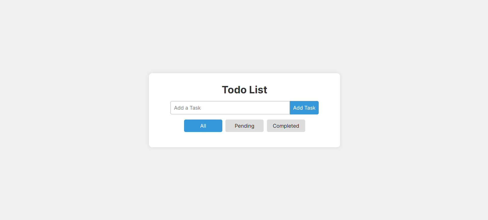
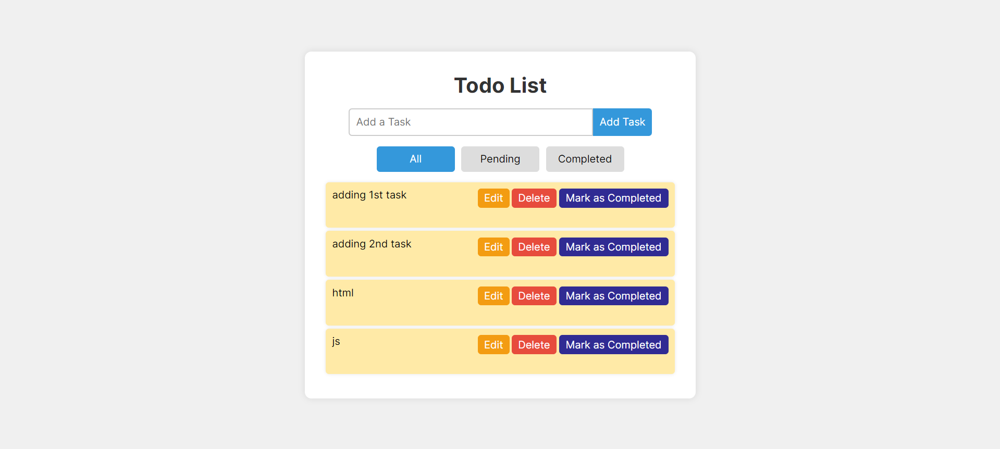
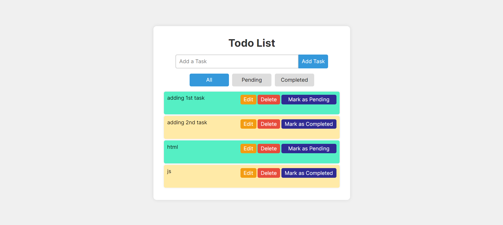
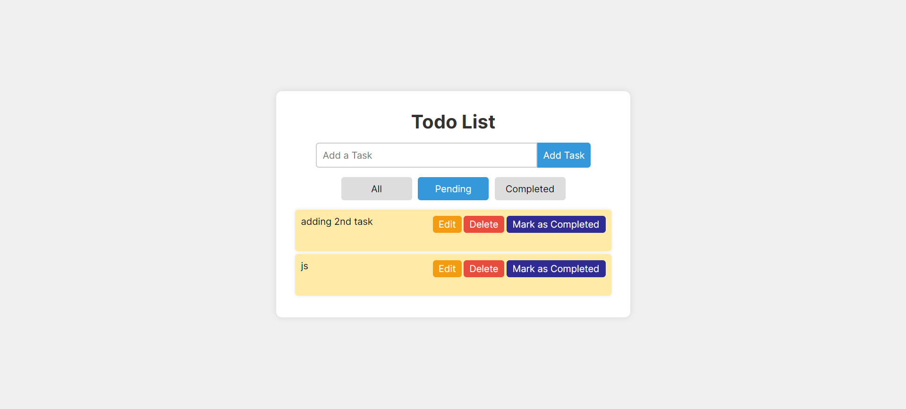
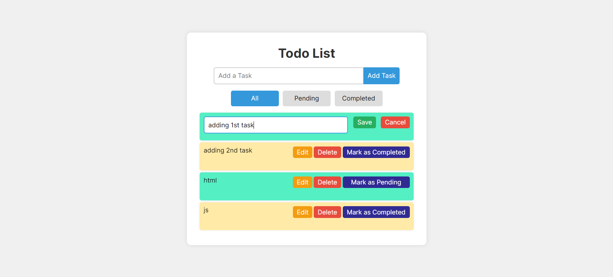
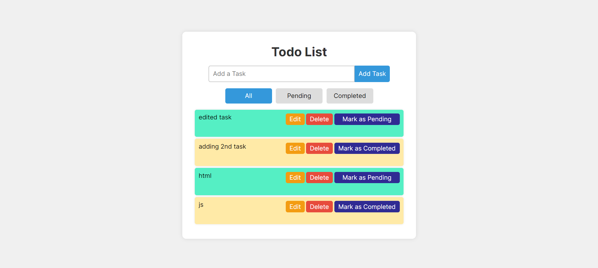
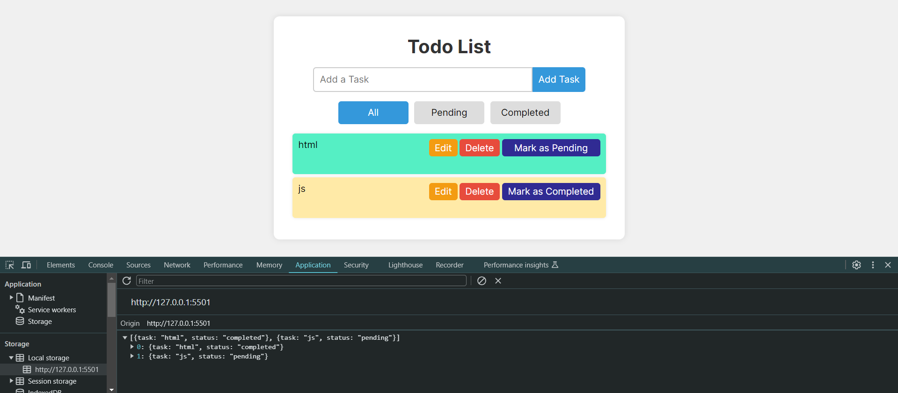
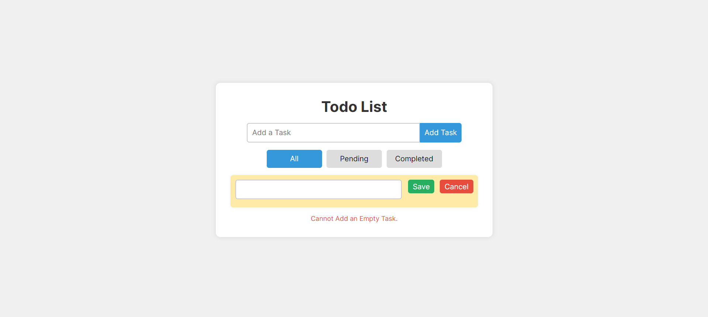
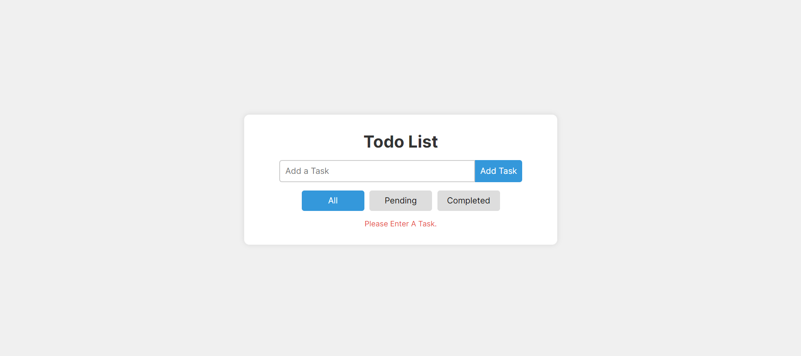

# Live Preview

https://svtrst.me/todo

# Todo List

A simple and interactive Todo List application to help you keep track of your tasks. This project demonstrates basic web development skills including HTML, CSS, JavaScript, and jQuery. View in Desktop mode only.

## Features

- Add tasks to your todo list.
- Edit existing tasks.
- Delete tasks from the list.
- Mark tasks as completed or pending.
- Filter tasks by their status: All, Pending, or Completed.
- Save tasks in the local storage so that they persist even after refreshing the page.
- Used localstorage to store the todos even after reload.

## Technologies Used

- HTML
- CSS
- JavaScript
- jQuery

## Getting Started

### Prerequisites

- A web browser to view the project.

### Installation

1. Clone the repository:

   ```sh
   git clone https://github.com/KartikLakhotiya/todo-list.git
   ```
2. Navigate to the project directory:

   ```sh
   cd todo-list
   ```
3. Open `index.html` in your web browser.

### Usage

1. Enter a task in the input field and click the `Add Task`button to add a new task to the list.
2. Use the `Edit` button to modify an existing task. Click `Save` to save the changes or `Cancel` to discard them.
3. Use the `Delete` button to remove a task from the list.
4. Use the `Mark as Completed` button to mark a pending task as completed, and the `Mark as Pending` button to revert it back to pending.
5. Use the tabs at the top to filter tasks by their status: All, Pending, or Completed.

## Screenshots



















## Contributing

1. Fork the repository.
2. Create a new branch: `git checkout -b feature-name`.
3. Make your changes and commit them: `git commit -m 'Add some feature'`.
4. Push to the branch: `git push origin feature-name`.
5. Submit a pull request.

## License

This project is licensed under the MIT License.
